# Mammon

## Table of Contents

- [Mammon](#mammon)
  - [Table of Contents](#table-of-contents)
  - [Product Vision](#product-vision)
  - [Mission Statement](#mission-statement)
  - [Value Proposition](#value-proposition)
  - [Workflow Architecture](#workflow-architecture)
    - [Workflow Hierarchy](#workflow-hierarchy)
    - [Workflow Layers](#workflow-layers)
    - [Key Design Patterns](#key-design-patterns)
  - [Roadmap](#roadmap)
  - [Utility Projects](#utility-projects)
  - [Releases](#releases)
  - [Backlog](#backlog)

Mammon is a DevOps solution developed by the Uniphar DevOps team.  
It is designed to generate detailed cost reports from Azure, applying custom rules to allocate costs to the appropriate cost centers.  
This solution addresses the challenge of allocating costs for resources that are shared among multiple projects, such as AKS, SQL Server, VDIs, and DevBoxes

## Product Vision

To deliver a cost tracking solution for cloud services that embodies Uniphar’s dedication to innovation, efficiency, and value creation.

This vision emphasizes providing a comprehensive, automated, and user-friendly tool while focusing on accountability and cost savings, which are crucial aspects of the product’s value proposition

## Mission Statement

The mission of Mammon is to equip stakeholders with transparent, real-time insights into Azure resource utilization.  
This fosters informed decision-making, resource optimization, and cost-effective management, aligning with Uniphar’s ethos of innovation, efficiency, and value creation

## Value Proposition

Mammon retrieves the costs of every resource in Azure and applies custom rules to allocate their respective costs to the proper cost center.  
This is particularly important because, in our context, Azure does not provide a way to identify clearly which resources belong to whom or in which scope they were created.  
Mammon uses knowledge of how resources are created, specifically naming conventions, and applies custom-defined rules to identify, group, and calculate costs.  
This includes calculating costs for resources uniquely used by a particular division or project and pro-rata costs for shared resources.

## Workflow Architecture

Mammon uses a hierarchical workflow architecture built on Dapr's workflow engine to orchestrate cost retrieval, processing, and allocation across Azure resources. The system follows a top-down approach: Tenant → Subscription → Resource processing.

### Workflow Hierarchy

```mermaid
graph TD
    A[TenantWorkflow] --> B[SubscriptionWorkflow]
    A --> Z[SendReportViaEmail Activity]
    
    B --> C[ObtainCostByPageWorkflow]
    C --> D[ObtainCostsActivity]
    
    B --> E[GroupSubWorkflow]
    E --> F[CallResourceActorActivity]
    E --> G[AssignCostCentreActivity]
    
    B --> H[VDIWorkflow]
    H --> H1[VDIGroupSplitObtainUsageActivity]
    H --> H2[VDIGroupSplitUsageActivity]
    H --> E
    
    B --> I[MySQLWorkflow]
    I --> I1[MySQLServerSplitUsageActivity]
    
    B --> J[AKSVMSSWorkflow]
    J --> J1[AKSVMSSObtainUsageDataActivity]
    J --> J2[AKSSplitUsageCostActivity]
    J --> E
    
    B --> K[SQLPoolWorkflow]
    K --> K1[SQLPoolSplitUsageActivity]
    
    B --> L[LAWorkspaceWorkflow]
    L --> L1[LAWorkspaceSplitUsageActivity]
    
    B --> M[ObtainVisualStudioSubscriptionsCostWorkflow]
    M --> N[SplitVisualStudioSubscriptionsCostsWorkflow]
    N --> N1[SplitVisualStudioSubscriptionsCostsActivity]
    
    B --> O[ObtainDevOpsCostWorkflow]
    O --> O1[ObtainDevOpsCostsActivity]
    
    B --> P[ObtainDevOpsProjectCostWorkflow]
    P --> Q[ObtainPagedDevOpsMembershipEntitlementsWorkflow]
    Q --> Q1[ObtainPagedDevOpsMembershipEntitlementsActivity]
    P --> P1[DevOpsProjectCostsActivity]
    
    B --> R[SplitDevopsCostsWorkflow]
    R --> R1[SplitDevopsCostsActivity]
    
    style A fill:#e1f5ff
    style B fill:#fff4e1
    style E fill:#e8f5e9
    style C fill:#f3e5f5
    style H fill:#ffe0e0
    style I fill:#ffe0e0
    style J fill:#ffe0e0
    style K fill:#ffe0e0
    style L fill:#ffe0e0
    style M fill:#fff9e1
    style O fill:#e8eaf6
    style P fill:#e8eaf6
    style R fill:#e8eaf6
```

### Workflow Layers

#### 1. Tenant Layer
- **TenantWorkflow**: Entry point that orchestrates cost processing across multiple Azure subscriptions
  - Spawns parallel `SubscriptionWorkflow` instances for each subscription
  - Sends email report after all subscription processing completes

#### 2. Subscription Layer
- **SubscriptionWorkflow**: Processes all resources within a single Azure subscription
  - **Cost Retrieval**: Uses `ObtainCostByPageWorkflow` to page through Azure Cost Management API
  - **Resource Grouping**: Groups resources by resource group for processing
  - **Splittable Resources**: Identifies and processes shared resources that require cost splitting

#### 3. Resource Processing Layer

##### Standard Resources
- **GroupSubWorkflow**: Processes non-splittable resources
  - Calls resource actors to aggregate costs
  - Assigns cost centres based on naming conventions and rules

##### Splittable Resources (Shared Infrastructure)
Resources that serve multiple projects/teams require special cost allocation:

- **VDIWorkflow**: Virtual Desktop Infrastructure pools
  - Obtains usage data from Log Analytics
  - Splits costs based on actual usage per user/project
  - Falls back to standard processing if usage data unavailable

- **AKSVMSSWorkflow**: Azure Kubernetes Service Virtual Machine Scale Sets
  - Queries usage metrics from Log Analytics
  - Allocates costs based on namespace/pod usage
  - Falls back if usage data unavailable

- **MySQLWorkflow**: MySQL Flexible Servers
  - Splits costs based on database usage patterns

- **SQLPoolWorkflow**: Synapse SQL Pools
  - Allocates costs based on workload distribution

- **LAWorkspaceWorkflow**: Log Analytics Workspaces
  - Splits costs based on data ingestion per resource
  - Processed last as it may contain data about other splittable resources

##### Visual Studio Subscriptions
- **ObtainVisualStudioSubscriptionsCostWorkflow**: Retrieves VS subscription costs
- **SplitVisualStudioSubscriptionsCostsWorkflow**: Allocates subscription costs to cost centres

##### Azure DevOps (Optional)
When DevOps organization is configured:
- **ObtainDevOpsCostWorkflow**: Retrieves total license costs
- **ObtainDevOpsProjectCostWorkflow**: Maps costs to projects based on user entitlements
- **SplitDevopsCostsWorkflow**: Allocates DevOps costs across cost centres

#### 4. Activity Layer
Activities are leaf-level operations that perform the actual work:
- **Data Retrieval**: Call Azure APIs (Cost Management, Monitor, DevOps)
- **Cost Aggregation**: Use Dapr actors for stateful cost accumulation
- **Cost Assignment**: Apply business rules to assign costs to cost centres

### Key Design Patterns

1. **Hierarchical Orchestration**: Parent workflows coordinate child workflows for parallel processing
2. **Actor Model**: Dapr actors provide stateful cost aggregation across distributed workflow executions
3. **Fallback Strategy**: Splittable resource workflows fall back to standard processing when data is unavailable
4. **Pagination**: Large datasets (costs, DevOps users) are processed in pages to handle rate limits
5. **Idempotency**: Workflow instance IDs ensure operations can be safely retried

## Roadmap

| Now                                                                                | Next                         | Future                                                                                                                                         |
| ---------------------------------------------------------------------------------- | ---------------------------- | ---------------------------------------------------------------------------------------------------------------------------------------------- |
| - Azure Subscriptions Cost Allocation   &nbsp;&nbsp;- Reporting   &nbsp;&nbsp;- Resource cost allocation    | - User Access   - Dashboards     | - Enhanced data visualization.   - Automated report generation.   - Additional integrations   - Advanced analytics   - Make it public \* |

\* Either make it public and open source, or allow other business units/partners to use it too.

## Utility Projects

[Mammon Cost Centre Mapping](https://github.com/Uniphar/MammonCostCentreMapping) - This project is a utility project that allows you to map cost centers to Azure resources and shared resources.

## Releases

| release | date | description |
| ------- | ---- | ----------- |
| v 0.0.1 - prototype | 2024-05-11 | Initial prototype |
| v 0.0.2 - prototype | 2024-05-15 | added regex support and report improvements |
| v 0.0.3 - prototype | 2024-05-22 | send email with cost report |

## Backlog
[Mammon Azure Devops Backlog](https://dev.azure.com/UnipharGroup/1/_backlogs/backlog/DevOps/Epics?showParents=false&System.AreaPath=Mammon)
